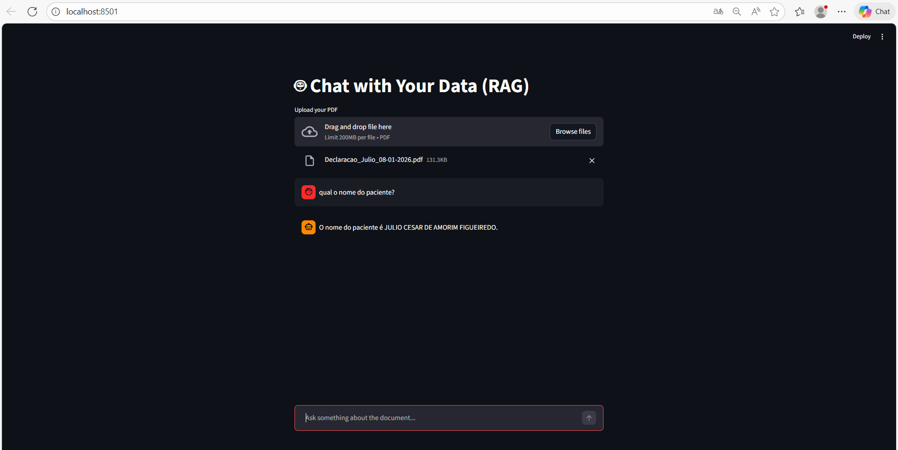

# 🤖 RAG Chatbot - Retrieval Augmented Generation

A powerful **Retrieval Augmented Generation (RAG)** application that enables intelligent conversations with PDF documents. Upload your PDFs and ask questions - the system will intelligently search and retrieve relevant information to provide accurate answers.

## 🎯 Features

- 📄 **PDF Upload**: Upload and process PDF documents automatically
- 🔍 **Semantic Search**: Intelligent document retrieval using embeddings
- 💬 **Interactive Chat**: Real-time Q&A with context-aware responses
- 🛡️ **File Validation**: Type and size validation (PDF only, max 20MB)
- ⚡ **Fast API Backend**: Built with FastAPI for high performance
- 🎨 **Beautiful UI**: Streamlit frontend for intuitive user experience
- 🐳 **Docker Support**: Easy deployment with Docker Compose



## 🏗️ Architecture

```
┌─────────────────────────────────────────────────────────┐
│                  FRONTEND (Streamlit)                   │
│                  Port: 8501                             │
│         - File Upload                                   │
│         - Chat Interface                                │
│         - Session Management                            │
└────────────────────┬────────────────────────────────────┘
                     │ HTTP
                     ↓
┌─────────────────────────────────────────────────────────┐
│                 BACKEND (FastAPI)                       │
│                 Port: 8000                              │
│         - /upload (PDF processing)                      │
│         - /chat (Query answering)                       │
└────────────────────┬────────────────────────────────────┘
                     │
                     ↓
┌─────────────────────────────────────────────────────────┐
│              RAG Engine (LangChain)                      │
│  - PDF Loader & Text Splitter                           │
│  - Google Generative AI Embeddings                      │
│  - Semantic Similarity Search                           │
│  - LLM Integration (Gemini)                             │
└────────────────────┬────────────────────────────────────┘
                     │
                     ↓
┌─────────────────────────────────────────────────────────┐
│                 ChromaDB (Vector Store)                 │
│            Persistent Document Storage                  │
└─────────────────────────────────────────────────────────┘
```

## 📋 Tech Stack

- **Frontend**: [Streamlit](https://streamlit.io/) - Interactive web UI
- **Backend**: [FastAPI](https://fastapi.tiangolo.com/) - Modern async web framework
- **LLM Chain**: [LangChain](https://www.langchain.com/) - RAG orchestration
- **Embeddings**: [Google Generative AI](https://ai.google.dev/) - Text embeddings
- **Vector DB**: [ChromaDB](https://www.trychroma.com/) - Vector storage
- **PDF Processing**: [PyPDF](https://pypi.org/project/pypdf/) - PDF extraction
- **Containerization**: Docker & Docker Compose

## 🚀 Quick Start

### Prerequisites

- Docker & Docker Compose installed
- Google Generative AI API Key (get it [here](https://makersuite.google.com/app/apikey))

### Setup with Docker (Recommended)

1. **Clone the repository**
   ```bash
   git clone <repository-url>
   cd RAG-Project
   ```

2. **Create `.env` file** in the project root
   ```bash
   echo "GEMINI_API_KEY=your_api_key_here" > .env
   echo "GEMINI_MODEL=gemini-2.5-flash" >> .env
   ```

3. **Start the application**
   ```bash
   docker-compose up --build
   ```

4. **Access the services**
   - Frontend: http://localhost:8501
   - Backend API: http://localhost:8000
   - API Docs: http://localhost:8000/docs

### Local Development Setup

1. **Create virtual environment**
   ```bash
   python -m venv venv
   source venv/bin/activate  # On Windows: venv\Scripts\activate
   ```

2. **Install backend dependencies**
   ```bash
   cd backend
   pip install -r requirements.txt
   cd ..
   ```

3. **Install frontend dependencies**
   ```bash
   cd frontend
   pip install -r requirements.txt
   cd ..
   ```

4. **Create `.env` file**
   ```bash
   echo "GEMINI_API_KEY=your_api_key_here" > .env
   echo "GEMINI_MODEL=gemini-2.5-flash" >> .env
   ```

5. **Start the backend** (in one terminal)
   ```bash
   cd backend
   uvicorn main:app --reload --host 0.0.0.0 --port 8000
   ```

6. **Start the frontend** (in another terminal)
   ```bash
   cd frontend
   streamlit run app.py
   ```

## 📖 Usage

1. **Upload a PDF**
   - Click on "Upload your PDF" button
   - Select a PDF file (max 20MB)
   - Wait for processing confirmation ✅

2. **Ask Questions**
   - Type your question in the chat input
   - AI will search the document and provide answers
   - Ask follow-up questions for deeper understanding

3. **Example Queries**
   - "What are the main topics discussed?"
   - "Summarize the key findings"
   - "What does section 3 say about X?"

## 🔧 Configuration

Edit environment variables in `.env`:

```env
# Google Generative AI
GEMINI_API_KEY=your_api_key_here
GEMINI_MODEL=gemini-2.5-flash

# Backend (optional)
BACKEND_URL=http://localhost:8000
```

### RAG Engine Configuration

Edit file processing parameters in `backend/services/rag_engine.py`:

```python
# Text splitting parameters
CHUNK_SIZE = 1000          # Characters per chunk
CHUNK_OVERLAP = 100        # Overlap between chunks

# Semantic search parameters
K = 3                      # Top K documents to retrieve
```

## 🔒 Validation

- ✅ File type validation (PDF only)
- ✅ File size limit (20MB)
- ✅ Error handling with descriptive messages
- ✅ Input sanitization

## 📁 Project Structure

```
RAG-Project/
├── backend/
│   ├── main.py              # FastAPI app entry point
│   ├── requirements.txt      # Backend dependencies
│   ├── Dockerfile           # Backend container
│   ├── routes/
│   │   └── routes.py        # API endpoints
│   └── services/
│       └── rag_engine.py    # RAG logic
├── frontend/
│   ├── app.py               # Streamlit app
│   ├── requirements.txt      # Frontend dependencies
│   └── Dockerfile           # Frontend container
├── chroma_db/               # Vector store (persistent)
├── temp/                    # Temporary file storage
├── docker-compose.yml       # Container orchestration
├── .env                     # Environment variables
└── README.md                # This file
```

## 🔄 How It Works

### Document Processing Flow
1. User uploads PDF
2. Backend validates file (type & size)
3. PDF is loaded and text is extracted
4. Text is split into chunks (1000 chars, 100 overlap)
5. Each chunk is embedded using Google Generative AI embeddings
6. Embeddings stored in ChromaDB vector store
7. Success message sent to user

### Chat Flow
1. User sends question
2. Question is embedded using same embeddings model
3. Semantic search finds top-3 similar document chunks
4. Context is provided to Google Gemini LLM
5. LLM generates answer based on context
6. Answer is sent back to user

## 📊 API Endpoints

### `POST /upload`
Upload and process a PDF file

**Request:**
```bash
curl -X POST "http://localhost:8000/upload" \
  -F "file=@document.pdf"
```

**Response:**
```json
{
  "filename": "document.pdf",
  "status": "Processed!"
}
```

### `POST /chat`
Ask a question about the uploaded document

**Request:**
```bash
curl -X POST "http://localhost:8000/chat" \
  -H "Content-Type: application/json" \
  -d {"question": "What is this document about?"}
```

**Response:**
```json
{
  "question": "What is this document about?",
  "answer": "This document discusses..."
}
```

### `GET /`
Health check

**Response:**
```json
{
  "message": "API is working!"
}
```

## 🐛 Troubleshooting

### Issue: "GEMINI_API_KEY not found"
**Solution**: Make sure `.env` file exists in project root with your API key

### Issue: "Connection Error" on frontend
**Solution**: Ensure backend is running and accessible at `BACKEND_URL`

### Issue: "Arquivo muito grande" (File too large)
**Solution**: Upload files smaller than 20MB

### Issue: "Tipo de arquivo não permitido"
**Solution**: Only PDF files are supported

## 🚀 Future Enhancements

- [ ] Multi-document support with file management
- [ ] User authentication and sessions
- [ ] Document metadata and indexing
- [ ] Export chat history
- [ ] Support for more file formats (DOCX, TXT)
- [ ] Streaming responses for real-time feedback
- [ ] RAG metrics and performance monitoring
- [ ] Fine-tuning capabilities

## 📝 License

This project is licensed under the MIT License - see LICENSE file for details

## 📚 References

- [LangChain Documentation](https://python.langchain.com/)
- [ChromaDB Documentation](https://docs.trychroma.com/)
- [FastAPI Documentation](https://fastapi.tiangolo.com/)
- [Streamlit Documentation](https://docs.streamlit.io/)
- [Google Generative AI](https://ai.google.dev/)
